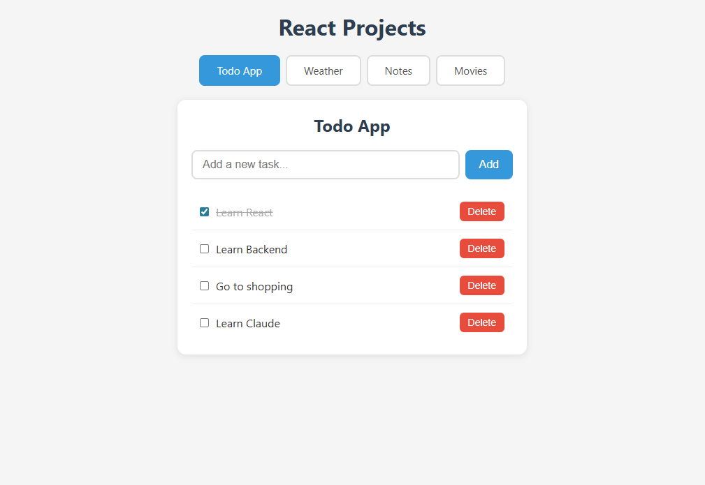
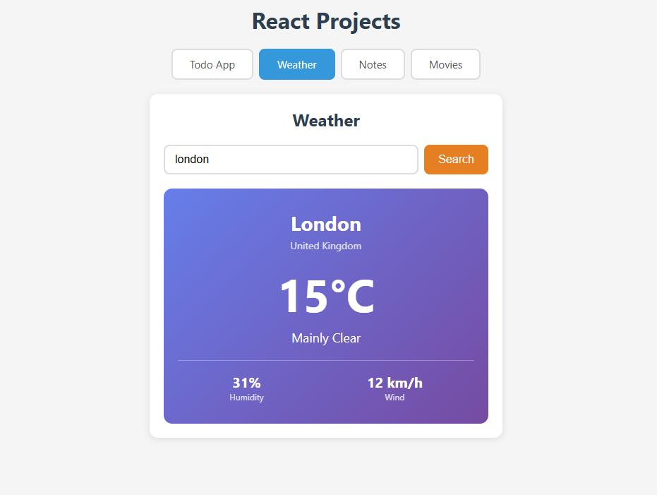
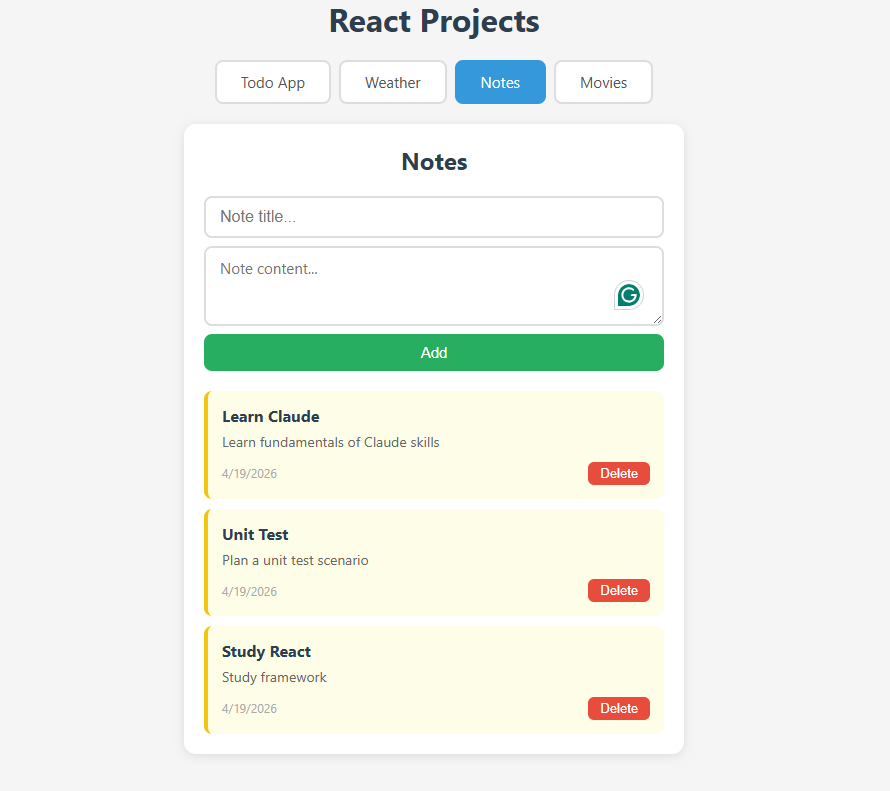
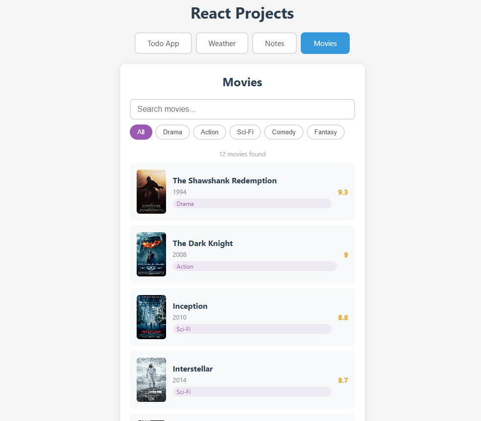

# First React Project

I'm a .NET developer who primarily builds desktop applications with WinForms. I wanted to expand my skills into frontend web development, so I decided to learn React from scratch. I had tried before but couldn't make it stick — this time, I took a different approach.

Instead of following tutorials passively, I built 4 progressively complex mini-apps, each one introducing a new set of React concepts. Coming from a WinForms background, thinking in components and state felt unfamiliar at first, but mapping React patterns to WinForms equivalents (e.g., useState as a property with automatic UI refresh, useEffect as Form_Load) made everything click.

This project helped me understand how React thinks — and if you're coming from a desktop development background like me, I hope it helps you too.

## Projects

### 1. Todo App
> **Concepts:** useState, JSX, event handling, list rendering with map(), immutability



---

### 2. Weather App
> **Concepts:** useEffect, fetch API, async/await, conditional rendering



---

### 3. Notes App
> **Concepts:** CRUD, localStorage, useEffect dependencies, props, component splitting



---

### 4. Movie App
> **Concepts:** React Router, URL parameters, search & filter, derived state



## Getting Started

```bash
npm install
npm run dev
```

Open [http://localhost:5173](http://localhost:5173) in your browser.

## Tech Stack

- React 19
- React Router
- Vite 8
- JavaScript
- Plain CSS

## Built With

This entire project was built with the help of [Claude Code](https://claude.ai/code) by Anthropic — from project setup to code, comments, and commit messages.

<p align="center">
  
  &nbsp;&nbsp;&nbsp;&nbsp;&nbsp;&nbsp;
  
</p>
